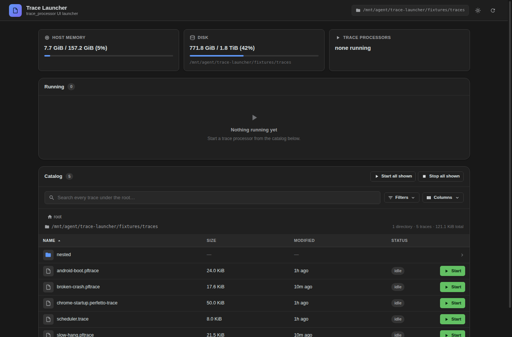
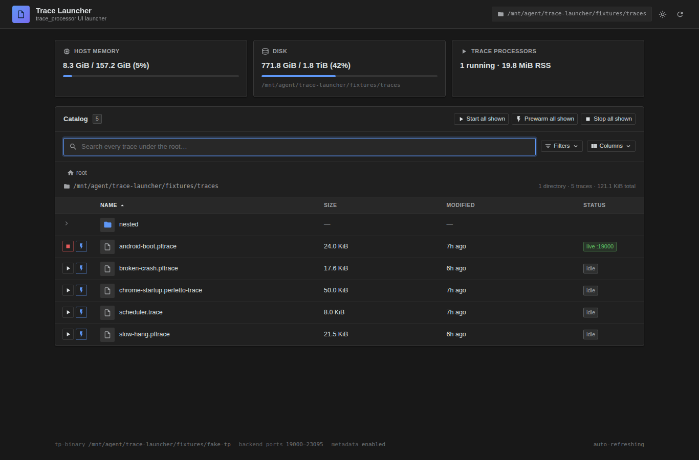
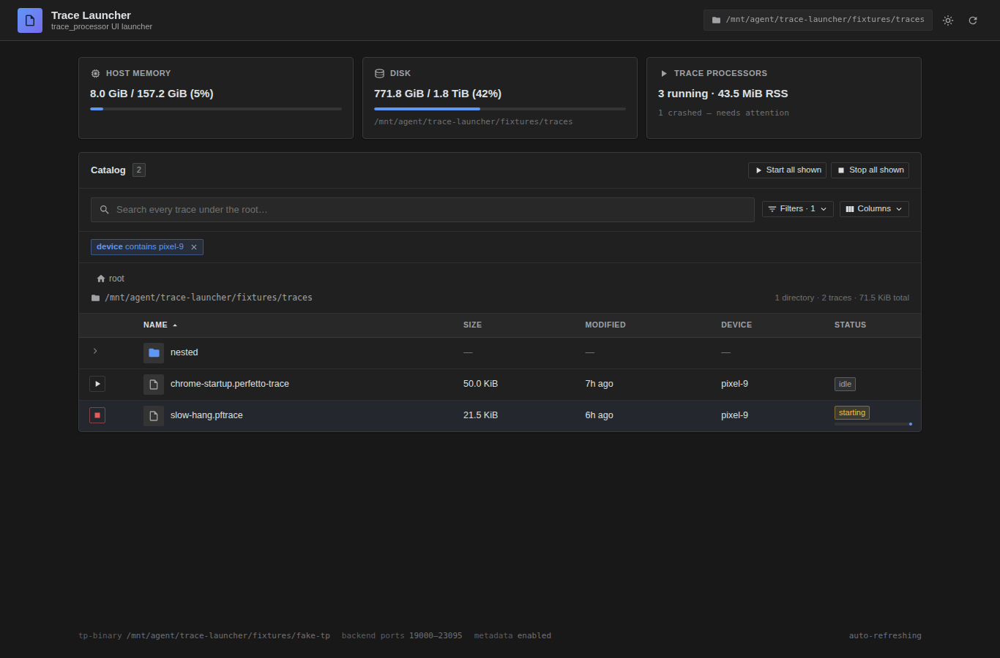
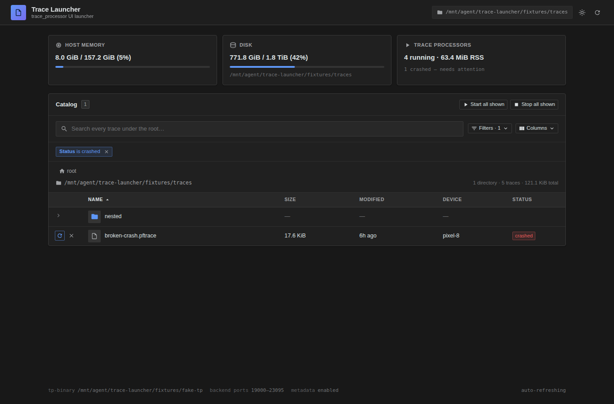
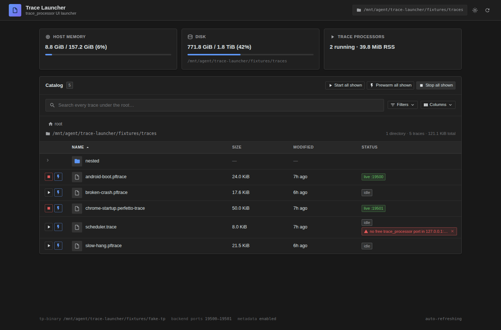
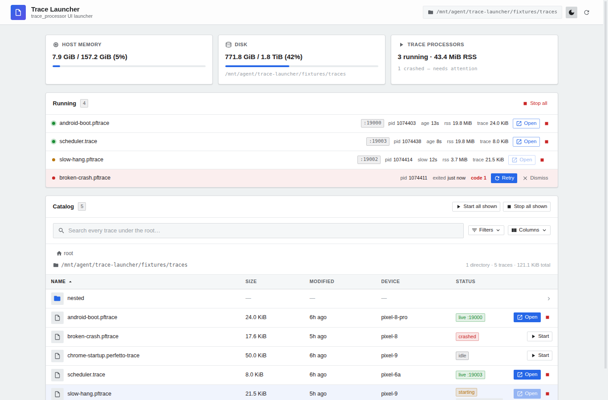

# Trace Launcher

A fast, minimal web UI for launching [`trace_processor_shell`][tp] servers from
a directory of Perfetto traces.

Point it at a folder of traces and a `trace_processor_shell` binary. It gives
you a browsable, searchable, filterable catalog; one click starts a
`trace_processor_shell server` for a trace and hands you a deep link straight
into [ui.perfetto.dev][ui]. It tracks every child process — live, still coming
up, or crashed — so you always know what is running and on which port.

It is the spiritual successor to the single-file `serve_trace_ui.py` operator
helper: same job, but a real typed front end and back end instead of
server-rendered HTML.

[tp]: https://perfetto.dev/docs/analysis/trace-processor
[ui]: https://ui.perfetto.dev

## Screenshots

| Catalog | Live, starting and crashed traces in one grid |
| --- | --- |
|  |  |

| Metadata filter | Filter by runtime state |
| --- | --- |
|  |  |

| Out-of-ports error, shown inline | Light theme |
| --- | --- |
|  |  |

## Features

- **One grid for everything.** Traces and their live state share a single
  catalog table. The leading column carries a fixed-width action slot
  (Start, Cancel, Stop, Retry, Open in Perfetto) so columns line up no
  matter what state a row is in. There is no separate "running" panel to
  keep in sync.
- **Browse, smart-search, sort — all server-side.** Walk the directory
  tree by clicking folders, or just type. The search is a case-insensitive
  AND-substring match across the full path — `android boot` finds
  `2026-05/android-boot.pftrace` and `cuttlefish/boot-android.pftrace`
  alike, regardless of where each token lands in the path. Recursive
  search is on by default; pass `--no-recursive-search` to scope it to
  the current directory. Sort by clicking any column header; a third
  click drops back to the server's *natural* breadth-first order
  (shallowest paths first), so a fresh recursive view stays scannable.
- **Filter on anything, including runtime state.** Structured filters on
  path, size, every column of the optional metadata DB, and on the live
  status (`idle`, `starting`, `live`, `crashed`). Metadata filters
  compile to parameterised SQL; status filters apply client-side because
  they depend on live process state. Search and filters cover every
  state uniformly.
- **One-click launch with deep link.** Starts are idempotent — a double-click
  never spawns two servers. The row shows the bound port and gives you a
  ui.perfetto.dev link wired to that port.
- **Batch actions — and they run in parallel.** "Start all shown",
  "Open all shown", and "Stop all shown" each honour the active filter
  and search. Starts run server-side with up to `nproc` workers in
  flight at once (configurable via `--batch-concurrency`), so opening a
  directory of 200 traces is bound by the port allocator, not a serial
  for-loop. "Open all shown" spawns one ui.perfetto.dev tab per live
  row via the anchor-click idiom — survives popup blockers that reject
  `window.open()` in a loop.
- **Honest status.** Every child is shown as `starting`, `live`, or
  `crashed` (with its exit code / signal) right inside its catalog row.
  A crash is never silent; retry or dismiss it inline.
- **Inline action errors.** If a start fails (e.g. the port pool is
  exhausted) the offending row shows a one-line error with a hint to free a
  port, plus an `×` dismiss. The error is per-row; the rest of the grid
  keeps working.
- **Optional metadata DB.** Join a SQLite table of per-trace metadata
  (device, duration, owner, …) onto the catalog for display and filtering,
  with distinct-value autocomplete in the filter editor.
- **Scales to thousands of rows.** Every row the server returns is in the
  DOM — no client-side cap and no "Show more" button. Off-screen rows are
  skipped from layout + paint by the browser via `content-visibility:
  auto`, so a 5000-row recursive view scrolls smoothly without a
  hand-rolled virtual scroller.
- **Configurable columns**, **dark / light themes**, debounced search that
  skips per-keystroke redraws, and inline progress on every start / stop
  action.

## Install — zero to running

You need **Node.js ≥ 18.19** and **git**. Trace-launcher itself works on
Linux and macOS (Windows under WSL is fine but untested in CI). Pick the
block that matches your OS, then everything after step 1 is identical.

### 1. Install Node and git

**Ubuntu / Debian** (the distro Node is usually too old — use NodeSource):

```sh
curl -fsSL https://deb.nodesource.com/setup_20.x | sudo -E bash -
sudo apt install -y nodejs git
```

**macOS** (with [Homebrew](https://brew.sh)):

```sh
brew install node git
```

**Anything else** — install Node 20 from <https://nodejs.org/> and `git`
from your package manager.

Verify:

```sh
node -v   # → v20.x or v18.19+
git --version
```

### 2. Clone and build

```sh
git clone https://github.com/fiveapplesonthetable/trace-launcher.git
cd trace-launcher
npm install
npm run build
```

`npm install` takes ~20 s; `npm run build` takes ~2 s. That's all the
setup — no global tools, no system packages beyond Node + git.

### 3. Run it

**With your own `trace_processor_shell` binary and trace dir** (the real
use case):

```sh
npm start -- \
  --tp-binary /path/to/trace_processor_shell \
  --traces-dir /path/to/traces \
  --recursive-search
```

Open <http://127.0.0.1:9002>. Done.

If you don't have a `trace_processor_shell` handy, grab one from the
[Perfetto release page][tp-bin] (drop the binary anywhere, point `--tp-binary`
at it).

[tp-bin]: https://perfetto.dev/docs/contributing/build-instructions#building-the-trace-processor

**Or try it with the bundled fixtures** — no real binary needed:

```sh
npm run dev
```

This serves the UI on <http://localhost:5173> with live reload, proxying the
API to a back end on `:9002` that uses `fixtures/fake-tp` and the sample
traces under `fixtures/traces/`. The fixture set includes a deliberately
`broken-crash.pftrace` and a `slow-hang.pftrace` so you can see how the UI
handles a crashing or stuck `trace_processor_shell`.

## Running it on a remote box (port forwarding)

A common shape: trace-launcher runs on a build host or shared workstation,
you view it from your laptop. You can't just forward port 9002 — when you
click **Open in Perfetto**, ui.perfetto.dev opens a WebSocket from *your
browser* directly to the trace_processor on the bound backend port
(default 19000+). You need to forward both the UI port **and** the backend
port range.

**Step 1**, on the remote box, start trace-launcher with a small port pool
so the forward stays short:

```sh
npm start -- \
  --tp-binary /path/to/trace_processor_shell \
  --traces-dir /path/to/traces \
  --recursive-search \
  --tp-port-base 19000 \
  --tp-port-count 8
```

**Step 2**, on your laptop, copy-paste this (set `HOST` to your remote SSH
target):

```sh
HOST=user@my-remote-box
ssh -N "$HOST" \
  -L 9002:127.0.0.1:9002 \
  -L 19000:127.0.0.1:19000 -L 19001:127.0.0.1:19001 \
  -L 19002:127.0.0.1:19002 -L 19003:127.0.0.1:19003 \
  -L 19004:127.0.0.1:19004 -L 19005:127.0.0.1:19005 \
  -L 19006:127.0.0.1:19006 -L 19007:127.0.0.1:19007
```

Leave the SSH session running. Open <http://127.0.0.1:9002> in your local
browser. Start a trace; click **Open in Perfetto**; the deep link works
because the trace_processor's port is forwarded too.

**Want a different pool size?** This one-liner forwards `$N` backend ports
for you:

```sh
HOST=user@my-remote-box
N=16   # must match --tp-port-count on the remote box
FWD="-L 9002:127.0.0.1:9002"
for i in $(seq 0 $((N-1))); do
  FWD="$FWD -L $((19000+i)):127.0.0.1:$((19000+i))"
done
ssh -N "$HOST" $FWD
```

## Configuration

All configuration is CLI flags — no config file, no env vars. The full set:

```
trace-launcher — a fast web UI for launching trace_processor_shell servers

Usage:
  npm start -- --tp-binary <path> --traces-dir <dir> [options]

Required:
  --tp-binary <path>         trace_processor_shell executable
  --traces-dir <dir>         directory of trace files to browse

Common:
  --bind <addr>              address for the UI + backend servers
                             (default 127.0.0.1 — local only)
  --port <n>                 port for the UI + API (default 9002)
  --no-recursive-search      scope search to the current directory only.
                             Recursive search is the default.
  --max-results <n>          max traces shown per page; 0 = unlimited
                             (default 5000)

Selecting specific traces (alternative to --traces-dir browsing):
  --trace <path>             expose only this trace; repeatable. Relative
                             paths resolve under --traces-dir, disabling
                             directory browsing.

Backend trace_processor port pool:
  --tp-port-base <n>         first backend trace_processor port
                             (default 19000)
  --tp-port-count <n>        size of the backend port range (default 4096)
  --batch-concurrency <n>    workers in flight for "Start all shown"
                             (default: clamp(nproc, 2, 8))

Metadata (optional — joins a SQLite table to the trace list):
  --metadata-db <path>       SQLite database with a row of metadata per trace
  --metadata-table <name>    table inside --metadata-db to read
  --metadata-key-column <c>  column holding the trace path/name to join on
                             (auto-detected from common names if omitted)
```

### Recipes

**Just browse my prod trace dir:**

```sh
npm start -- \
  --tp-binary ~/perfetto/out/linux/trace_processor_shell \
  --traces-dir ~/captures \
  --recursive-search
```

**Serve over the network so the team can reach it:**

```sh
npm start -- \
  --tp-binary ~/perfetto/out/linux/trace_processor_shell \
  --traces-dir /srv/captures \
  --bind 0.0.0.0 \
  --port 9002
```

`--bind 0.0.0.0` exposes the UI **and** the backend trace_processor pool on
the public interface. Put it behind your usual SSO / firewall — there is no
auth in the app itself.

**Use my company's metadata DB to filter + sort:**

```sh
npm start -- \
  --tp-binary ~/perfetto/out/linux/trace_processor_shell \
  --traces-dir /srv/captures \
  --recursive-search \
  --metadata-db /srv/captures/index.sqlite \
  --metadata-table runs
```

Toggle columns on from the **Columns** menu; filter with autocomplete from
the **Filters** dropdown. The key column joins on absolute path, path
relative to `--traces-dir`, or basename — whichever your data uses works.

**Expose only one or two traces from a much larger directory:**

```sh
npm start -- \
  --tp-binary ~/perfetto/out/linux/trace_processor_shell \
  --traces-dir /srv/captures \
  --trace 2026-05-12/app-launch.pftrace \
  --trace 2026-05-13/jank.pftrace
```

### Metadata database

`--metadata-db` points at any SQLite database; `--metadata-table` picks the
table. Each row is joined to a trace by a key column — its value is matched
against the trace's absolute path, its path relative to the root, or its base
name, so a table of bare filenames and a table of absolute paths both work.
The key column is auto-detected from common names (`path`, `trace`, `file`, …)
or set explicitly with `--metadata-key-column`.

Every column of that table becomes available in the catalog: toggle it on from
the **Columns** menu, sort by it, and filter on it. Metadata filters are
compiled to parameterised SQL and run against the database; text columns offer
distinct-value autocomplete in the filter editor.

### Port pool sizing

Every trace you start binds one `trace_processor_shell` to one TCP port from
the pool `[--tp-port-base, --tp-port-base + --tp-port-count)`. The defaults
give you 4096 ports starting at 19000 — enough that you'll never hit the
ceiling in normal use. If you do, the next start surfaces an inline
`OUT_OF_PORTS` error on the offending row with a hint to stop something. To
shrink the range deliberately (for sandboxing or to test the error path):

```sh
npm start -- … --tp-port-base 19500 --tp-port-count 8
```

## Troubleshooting

- **`EADDRINUSE` on startup.** Another process owns `--port` (default 9002)
  or one of the backend ports in the pool. Pick a different `--port` or
  shift `--tp-port-base`.
- **`OUT_OF_PORTS` on every start.** You shrank `--tp-port-count` too far,
  or you have many lingering children. Stop a few rows, or restart the
  launcher.
- **A trace shows `starting` and never flips to `live`.** The
  `trace_processor_shell` is hanging — almost always a malformed or
  truncated trace. The row will eventually transition to `crashed` when
  the child exits.
- **"Cannot reach the trace-launcher server" toast.** The Node process died
  or you stopped it. Re-run `npm start`.

## Development

```sh
npm run dev          # API + UI with live reload (uses the fixtures)
npm run typecheck    # tsc --noEmit for both the SPA and the server
npm run test         # unit tests (node:test)
npm run build        # production SPA bundle
npm run check        # typecheck + test + build
npm run seed         # rebuild fixtures/metadata.db
```

### End-to-end UI tests

There are two complementary end-to-end suites under `tests/e2e/`, both
boot the real server against the bundled fixtures and drive a headed
Chrome via Playwright.

**`tests/e2e/test_ui.py`** — deterministic golden path. Covers the
start → live path, a crashing trace_processor, a hanging one,
double-click idempotency, the column picker, a metadata SQL filter,
directory navigation, the theme toggle, and a second server with a
2-port pool that exercises the out-of-ports inline error and its
dismissal.

**`tests/e2e/test_chaos.py`** — property-style chaos. Random Start/Stop
bursts across many rows, ten rapid Start clicks on one row (regression
guard for the in-flight dedup), out-of-band kills with SIGKILL /
SIGSEGV / SIGTERM that must surface the right chip label, a hard
browser reload mid-life, and a small-pool exhaustion + recovery cycle.
Kill scenarios use `os.kill` against the positive child pid with three
layered safety guards (pid ≥ 1000, not the test runner's ancestor
chain, `/proc/<pid>/comm` in an allowlist) so a stale or zero pid can
never escalate into the catastrophic `kill -<sig> -1` process-group
form.

```sh
python3 -m venv .e2e-venv && .e2e-venv/bin/pip install playwright \
  && .e2e-venv/bin/playwright install chromium
npm run build
TL_E2E_HEADLESS=1 .e2e-venv/bin/python tests/e2e/test_ui.py     # deterministic
TL_E2E_HEADLESS=1 .e2e-venv/bin/python tests/e2e/test_chaos.py  # chaos
```

Drop `TL_E2E_HEADLESS=1` to run either headed under a recorder.

## Architecture

```
shared/      Wire-protocol types imported by both sides — the single contract.
server/      Node + Express API. No UI logic.
  catalog.ts          lists / searches / filters traces, resolves UI-supplied paths
  process_manager.ts  spawns, tracks, and reaps trace_processor_shell children
  metadata.ts         optional SQLite metadata: columns, joins, SQL filters, suggest
  ports.ts            TCP port probing + round-robin allocation
  system.ts           host memory / disk / per-process RSS
  config.ts           CLI parsing and validation
  api.ts              the HTTP routes — a thin layer over the modules above
src/         Mithril + TypeScript SPA.
  core/               API client and the application store (state + poll loop)
  widgets/            reusable building blocks (Button, Dropdown, ProgressBar, …)
  components/         the screen: top bar, system bar, catalog
  base/               pure, DOM-free helpers (formatting, classnames)
fixtures/    A fake trace_processor_shell, sample traces, and a metadata DB.
```

The browser cannot spawn processes, so a small Node server does it. The SPA
polls `POST /api/state` for a full snapshot (catalog page + running children +
host stats); cadence speeds up automatically while a child is starting. Every
trace is identified by its absolute real path — the client only ever echoes
back keys the server handed out, and every path is re-validated against the
configured root before use.

## License

Apache-2.0
